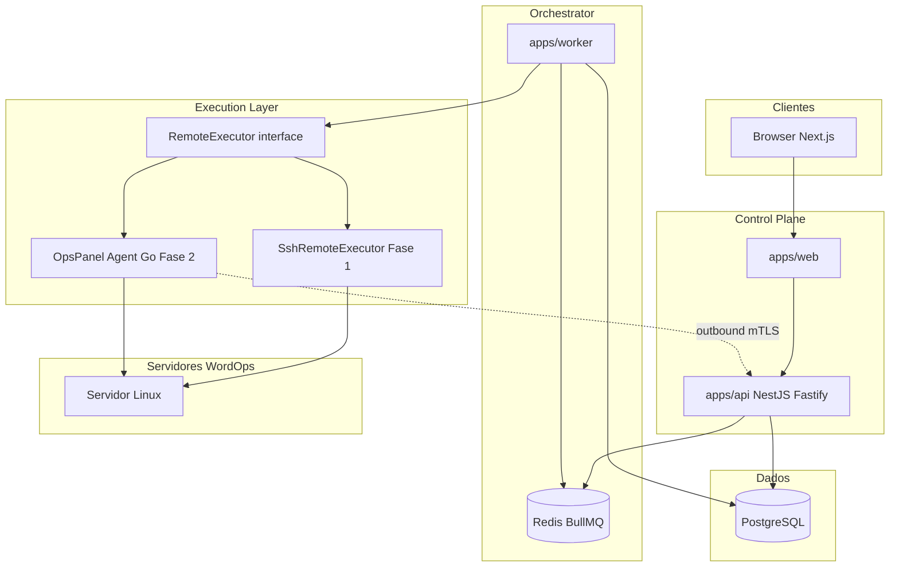

# OpsPanel — Arquitetura do sistema

Versão: 1.0  
Data: 29 de julho de 2026

## 1. Objetivo

Descrever a arquitetura alvo do OpsPanel alinhada ao PRD v1.0 e à implementação incremental iniciada na Fase 1.

## 2. Diagrama lógico



## 3. Camadas

### 3.1 Control Plane

| Componente | Responsabilidade |
|------------|------------------|
| `apps/web` | App Router, TanStack Query, layout glass, fluxos operacionais |
| `apps/api` | REST `/api/v1`, auth, RBAC, validação, criação de jobs, audit |

Regras:

- Frontend envia apenas **operações tipadas** (via REST), nunca shell.
- Respostas não expõem segredos, stack traces em produção ou chaves privadas após cadastro.

### 3.2 Orchestrator

| Componente | Responsabilidade |
|------------|------------------|
| `apps/worker` | Consumir filas BullMQ, locks, executar `RemoteExecutor`, persistir `JobEvent` |
| Redis | Filas, rate limit auxiliar, coordenação |
| PostgreSQL | Estado definitivo de jobs, servidores, audit |

Fluxo de job (mutação demorada):

1. API valida auth + RBAC + input (Zod/contracts).
2. API cria `Job` (status `queued`) e enfileira.
3. Worker adquire lock, transita estados, chama executor, sanitiza logs.
4. Worker grava resultado observado e audit.
5. Cliente acompanha via GET job/events (SSE na Fase 2).

### 3.3 Execution Layer

Interface alvo (`packages/contracts`):

```typescript
interface RemoteExecutor {
  testConnection(ctx: ExecutionContext): Promise<ConnectionResult>;
  executeOperation(ctx: ExecutionContext, operation: TypedServerOperation): Promise<ExecutionResult>;
  streamOperation(ctx: ExecutionContext, operation: TypedServerOperation): AsyncIterable<ExecutionEvent>;
}
```

Implementações:

| Implementação | Fase | Uso |
|---------------|------|-----|
| `SshRemoteExecutor` | 1 | Teste de conexão, probes iniciais, bootstrap opcional P1 |
| `AgentRemoteExecutor` | 2+ | Catálogo allowlist, mTLS, inventory, WordOps |

Integração WordOps isolada em `packages/wordops` (builders argv, parsers, capabilities).

## 4. Monorepo

```
opspanel/
  apps/
    web/                 # Next.js
    api/                 # NestJS + Fastify
    worker/              # BullMQ processors
    agent/               # Go (Fase 2)
  packages/
    ui/                  # shadcn + tokens
    database/            # Prisma
    contracts/           # tipos e operation keys
    validation/          # Zod compartilhado
    config/              # env
    security/            # crypto, redaction
    wordops/             # adapter WordOps
    observability/       # logger, request id
    eslint-config/
    typescript-config/
  infra/docker/
  docs/
```

## 5. Modelo de dados (visão)

Entidades principais (PostgreSQL via Prisma):

- **Identidade:** User, Session, Organization, OrganizationMember, Role (enum), Permission (futuro granular).
- **Infra:** Server, ServerCredential (ciphertext), ServerCapability, ServerHealthSnapshot.
- **Sites:** Site, SiteDomain, SiteRuntime (Fase 3+).
- **Operação:** Job, JobEvent, AuditLog.
- **Futuro:** SiteAccessUser, Backup, Alert, ApiKey, Notification.

Regras:

- `organizationId` em todos os recursos tenant-scoped.
- Soft delete em Server/Site onde aplicável.
- Credenciais: apenas metadata + ciphertext; rotação substitui, nunca revela valor anterior.

## 6. Integração WordOps

```
API operation key → Orchestrator → RemoteExecutor → wordops adapter
                                                      ↓
                                              argv[] + env controlado
                                                      ↓
                                              parsers + sanitizers
                                                      ↓
                                              verification probes
```

Operações catalogadas (exemplos): `server.connection.test`, `server.wordops.detect`, `site.create`, `site.ssl.enable`.

Cada operação define: input schema, auth policy, allowed commands, timeout, retry, lock key, pós-verificação.

## 7. Segurança

| Controle | Implementação |
|----------|----------------|
| Auth | Sessão cookie HttpOnly, Secure, SameSite; Argon2id |
| RBAC | Papéis owner/admin/operator/developer/viewer; guard NestJS |
| Tenant | Filtro `organizationId` em queries; deny by default |
| Segredos | AES-256-GCM envelope (Fase 1); KMS externo (produção) |
| API | Helmet, CORS restrito, rate limit, CSRF em mutações cookie |
| Execução | Allowlist de operation keys; argv; redaction em logs |
| Audit | Append-only AuditLog com actor, action, target, IP, metadata sanitizado |

## 8. Observabilidade

- **Fase 1:** Pino JSON, `requestId`, `jobId` em logs; `/health` e `/ready`.
- **Futuro:** OpenTelemetry, métricas Prometheus, Sentry.

## 9. Deploy local

Docker Compose: PostgreSQL 16, Redis 7, Mailpit (opcional), MinIO (opcional Fase 4).

Apps Node rodam no host ou em containers conforme `infra/docker`.

## 10. Evolução PRD ↔ código

O PRD prioriza **agente mTLS** como decisão arquitetural principal. A Fase 1 valida o **vertical slice** (auth, jobs, audit, UI) com **SSH gerenciado pelo backend** atrás de `RemoteExecutor`, para não bloquear produto enquanto o agente Go é desenvolvido em paralelo (Fase 2).
